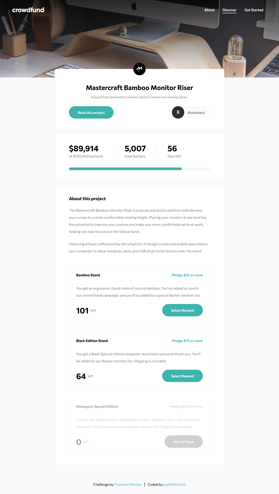

# Frontend Mentor - Crowdfunding product page solution

This is a solution to the [Crowdfunding product page challenge on Frontend Mentor](https://www.frontendmentor.io/challenges/crowdfunding-product-page-7uvcZe7ZR). Frontend Mentor challenges help you improve your coding skills by building realistic projects.

## Table of contents

- [Overview](#overview)
  - [The challenge](#the-challenge)
  - [Screenshot](#screenshot)
  - [Links](#links)
- [My process](#my-process)
  - [Built with](#built-with)
  - [What I learned](#what-i-learned)
- [Author](#author)

## Overview

### The challenge

Users should be able to:

- View the optimal layout depending on their device's screen size
- See hover states for interactive elements
- Make a selection of which pledge to make
- See an updated progress bar and total money raised based on their pledge total after confirming a pledge
- See the number of total backers increment by one after confirming a pledge
- Toggle whether or not the product is bookmarked

### Screenshot



### Links

- Solution URL: [Add solution URL here]()
- Live Site URL: [Add live site URL here]()

## My process

### Built with

- [Vite](https://vitejs.dev/)
- [React](https://reactjs.org/)
- [TypeScript](https://www.typescriptlang.org/)
- [TailwindCSS](https://tailwindcss.com/)

### What I learned

The ability to create a more complex yet still intuitive and easy to use application that moves between and keeps track of many different states. This was done by using useReducer to have all the state logic in one place and useContext to prevent excessive prop-drilling. One thing I need to improve on is how to use Typescript properly to implement type-checking (especially for the context).

```tsx
function PledgeDataProvider({ children }: { children: React.ReactNode }) {
  const [
    {
      items,
      modalState,
      bookMarked,
      totalPledged,
      totalBackers,
      daysLeft,
      pledgeError,
    },
    dispatch,
  ] = useReducer(reducer, initialState);
  return (
    <PledgeDataContext.Provider
      value={
        {
          items,
          modalState,
          bookMarked,
          totalPledged,
          totalBackers,
          daysLeft,
          pledgeError,
          dispatch,
        } as IPledgeDataProvider
      }
    >
      {children}
    </PledgeDataContext.Provider>
  );
}
```

## Author

- GitHub - [@josh76543210](https://github.com/josh76543210)
- Frontend Mentor - [@josh76543210](https://www.frontendmentor.io/profile/josh76543210)
- Twitter - [@josh76543210](https://www.twitter.com/josh76543210)
